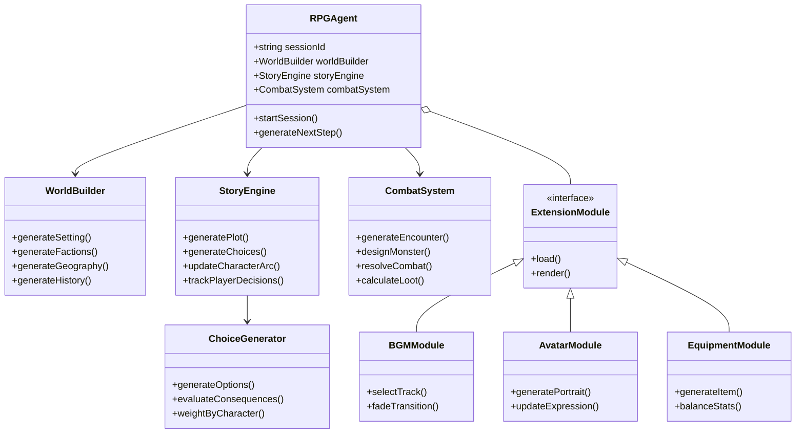

```mermaid
classDiagram
    %% 核心引擎
    class RPGAgent {
        +string sessionId
        +WorldBuilder worldBuilder
        +StoryEngine storyEngine
        +CombatSystem combatSystem
        +startSession()
        +generateNextStep()
    }

    %% 世界观生成
    class WorldBuilder {
        +generateSetting()
        +generateFactions()
        +generateGeography()
        +generateHistory()
    }

    %% 剧情与角色塑造
    class StoryEngine {
        +generatePlot()
        +generateChoices()
        +updateCharacterArc()
        +trackPlayerDecisions()
    }

    %% 选项生成
    class ChoiceGenerator {
        +generateOptions()
        +evaluateConsequences()
        +weightByCharacter()
    }

    %% 战斗与怪物设计
    class CombatSystem {
        +generateEncounter()
        +designMonster()
        +resolveCombat()
        +calculateLoot()
    }

    %% 扩展模块接口
    class ExtensionModule {
        <<interface>>
        +load()
        +render()
    }

    %% 具体扩展
    class BGMModule {
        +selectTrack()
        +fadeTransition()
    }

    class AvatarModule {
        +generatePortrait()
        +updateExpression()
    }

    class EquipmentModule {
        +generateItem()
        +balanceStats()
    }

    %% 关系
    RPGAgent --> WorldBuilder
    RPGAgent --> StoryEngine
    RPGAgent --> CombatSystem
    StoryEngine --> ChoiceGenerator
    RPGAgent o-- ExtensionModule
    ExtensionModule <|-- BGMModule
    ExtensionModule <|-- AvatarModule
    ExtensionModule <|-- EquipmentModule
```
